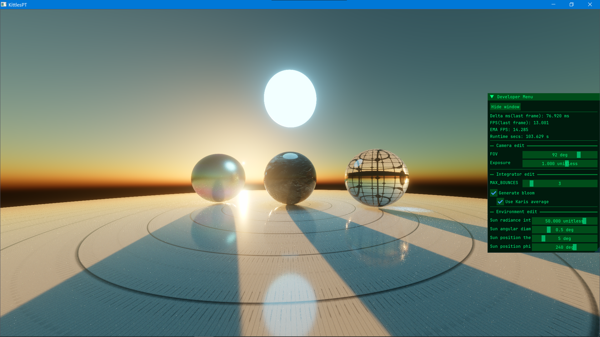
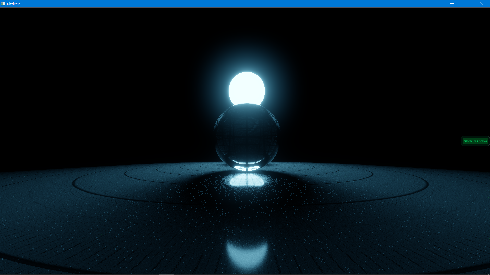

<h1><u>KittlesPT</u> - A CUDA PathTracing renderer library</h2>

A casual hobby project towards creating an interactive path-tracing renderer running on non-RTX GPUs.

<h3><u>Features</u></h3>
<ul>
<li>Multiple Importance Sampling</li>
<li>Nishita Sky model</li>
<li>Bloom / Veil</li>
<li>Only sphere geometry</li>
<li>Unified BSDF</li>
<li>Albedo texture support</li>
</ul>

<h3><u>External Dependencies</u></h3>
<ul>
<li>CUDA 12.4+ SDK</li>
</ul>

<h3><u>Libraries used</u></h3>
<ul>
<li>GLAD - OpenGL loader</li>
<li>GLM - 3D maths library</li>
<li>Optional <b>(SampleApp)</b>
<ul>
<li>GLFW - OpenGL windowing library</li>
<li>Dear ImGUI - GUI library</li>
<li>stb - Image loading library</li>
<li>TinyGLTF - GLTF format load/parse library</li>
</ul>
</li>
</ul>

<h3><u>Building</u></h3>

<b>Cmake will be added in future.</b> Currently the solution is Visual Studio only.
The solution consists of two projects, the core <u>KittlesPT</u> static library project, and a <u>SampleApp</u> executable project demonstrating the use of KittlesPT renderer API.

